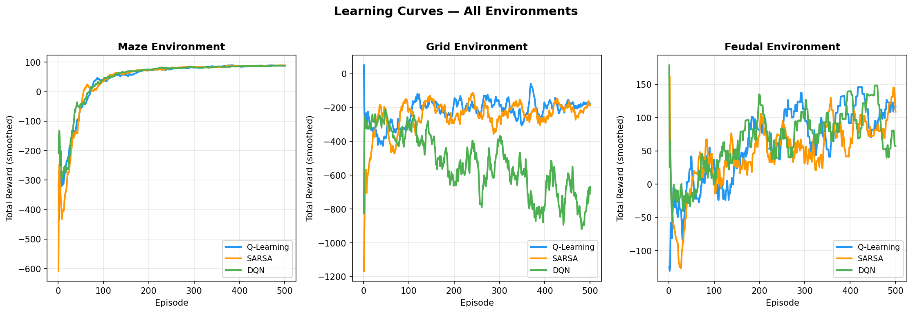
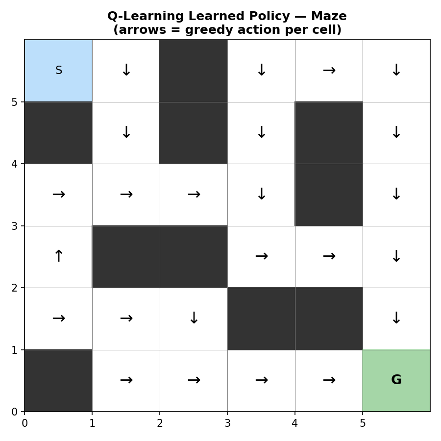
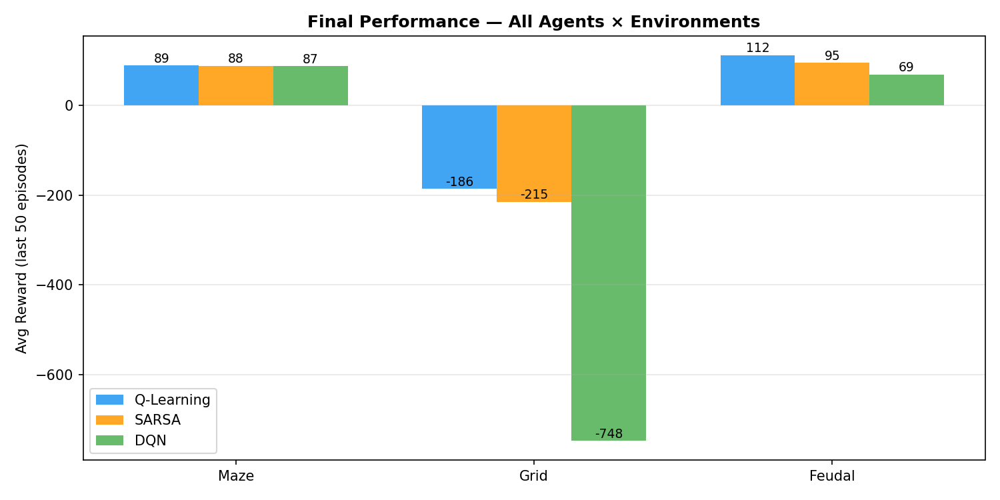
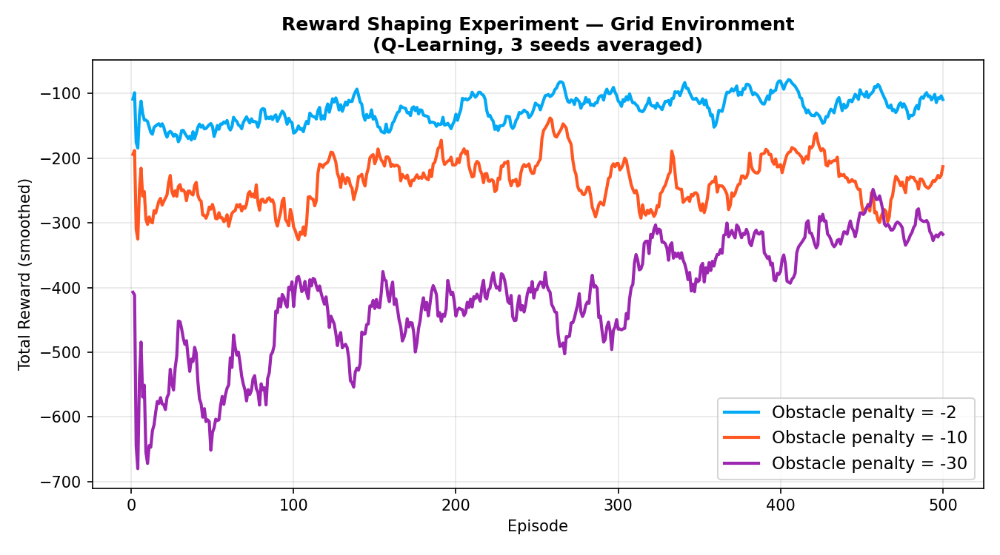

# Reinforcement Learning — Multi-Environment Agent Comparison

**Machine Learning | MSc Supply Chain Digitalisation**

A reinforcement learning system built from scratch that trains agents to play games through trial and error. Three environments of increasing complexity are paired against three RL algorithms to evaluate how model choice and reward design influence learning behaviour.

---

## Project Overview

Instead of learning from a static dataset, agents interact with self-defined environments. At each step, the agent observes the current **state**, selects an **action**, and receives a **reward** — iterating until it discovers a policy that maximises cumulative reward.

### Research Questions
1. How do Q-Learning, SARSA, and DQN compare in convergence speed and final performance?
2. How does environment complexity affect learning?
3. How does reward design (reward shaping) change agent behaviour?

---

## Environments

| Environment | Grid Size | State Space | Complexity |
|-------------|-----------|-------------|------------|
| **Maze** | 12 × 12 | 144 states | Low — fixed walls, deterministic |
| **Grid Navigation** | 16 × 16 | 256 states | Medium — random obstacles + random goal each episode |
| **Feudal Warfare** | — | 25 states | High — stochastic enemy, resource management |

### Maze
Fixed-wall 12×12 grid. Agent starts at `(0,0)`, goal at `(11,11)`. Must navigate around walls.
Rewards: `+100` goal · `-1` step · `-5` wall hit

### Grid Navigation
Open 16×16 grid with randomly placed obstacles (~15% density). Goal position randomises each episode — the agent must generalise, not just memorise a path.
Rewards: `+100` goal · `-1` step · `-10` obstacle · `-5` out of bounds

### Feudal Warfare
Territory-control strategy game. Agent commands units against a rule-based enemy across 8 territories.
Actions: `ATTACK` · `FORTIFY` · `RECRUIT` · `RAID`
Rewards: `+20` / `-20` territory capture/loss · `+100` / `-100` win/lose · `+1` survive

---

## Algorithms

### Q-Learning (Off-policy TD)
Tabular method. Updates toward the **best possible** next action regardless of what was actually taken.

```
Q(s,a) ← Q(s,a) + α [ r + γ max Q(s',a') − Q(s,a) ]
```

### SARSA (On-policy TD)
Tabular method. Updates toward the **action actually taken** next — more conservative, accounts for its own exploration.

```
Q(s,a) ← Q(s,a) + α [ r + γ Q(s', a') − Q(s,a) ]
```

### DQN — Deep Q-Network
Replaces the Q-table with a neural network. Scales to large/continuous state spaces where tabular methods fail.

```
Architecture: Input (one-hot) → Linear(128) → ReLU → Linear(128) → ReLU → Linear(n_actions)
```

Key additions over tabular: **experience replay** (random minibatches break correlations) and a **target network** (frozen copy used for stable TD targets, synced every 200 steps).

---

## Results

Training: 500–1000 episodes per agent × environment combination. Average reward over the last 50 episodes:

| Environment | Q-Learning | SARSA | DQN |
|-------------|-----------|-------|-----|
| **Maze** | -23.3 | **87.9** | 87.5 |
| **Grid** | -185.8 | -215.2 | -747.6 |
| **Feudal** | **111.5** | 94.6 | 110.1 |

*Best single-episode reward: Maze 91 · Grid 100 · Feudal 211*

### Learning Curves



### Q-Learning Learned Policy — Maze

The arrows show the greedy action at each cell after training. Clear directional structure emerges — the agent has learned to navigate around walls efficiently.



### Final Performance Comparison



### Reward Shaping Experiment

Varying the obstacle penalty in Grid Navigation shows how reward design directly controls risk aversion. A light penalty (-2) produces reckless exploration; a heavy penalty (-30) produces over-cautious behaviour; the middle ground (-10) balances both.



---

## Setup

**Requirements:** Python 3.10+

```bash
pip install torch numpy matplotlib pandas jupyter ipywidgets
```

Clone and enter the project:
```bash
git clone https://github.com/ardaturker/ml-semester-project.git
cd ml-semester-project
```

---

## Usage

### Train an agent (with live learning curve)
```bash
python3 train.py --env maze --agent qlearning
python3 train.py --env feudal --agent dqn --episodes 1000
```

### Continue training from a saved checkpoint
```bash
python3 train.py --env maze --agent qlearning --continue
```

### Watch the trained agent play
```bash
python3 play.py --env maze --mode watch --agent qlearning
python3 play.py --env feudal --mode watch --agent dqn --delay 0.6
```

### Play yourself
```bash
python3 play.py --env maze --mode human      # WASD / arrow keys
python3 play.py --env feudal --mode human    # 1=Attack 2=Fortify 3=Recruit 4=Raid
```

### Generate all plots
```bash
python3 visualize.py
```

### Open the analysis notebook
```bash
jupyter notebook notebook.ipynb
```

Full command reference: [`COMMANDS.txt`](COMMANDS.txt)

---

## Project Structure

```
.
├── train.py                  # Training — live plot, save/load, --continue flag
├── play.py                   # Interactive play + agent watch (curses terminal)
├── visualize.py              # Static plot generation
├── config.py                 # All hyperparameters
├── COMMANDS.txt              # Full command reference
├── notebook.ipynb            # Analysis notebook + interactive Section 5
│
├── environments/
│   ├── base_env.py           # Abstract interface
│   ├── maze_env.py           # 12×12 maze
│   ├── grid_env.py           # 16×16 grid with obstacles
│   └── feudal_env.py         # Feudal territory control
│
├── agents/
│   ├── q_learning.py         # Tabular Q-Learning
│   ├── sarsa.py              # SARSA
│   └── dqn.py                # Deep Q-Network (PyTorch)
│
└── results/
    ├── agents/               # Saved agent checkpoints (.pkl / .pt)
    ├── figures/              # Generated plots (.png)
    └── *.csv                 # Episode reward histories
```

---

## Conclusion

This project demonstrated that reinforcement learning can successfully train agents across environments of varying complexity — without any labelled data. Several key findings emerged:

**On algorithm choice:**
SARSA and DQN both converged reliably on the Maze (~88 avg reward), reaching near-optimal performance by episode 500. Q-Learning was competitive but slightly less stable due to its aggressive off-policy updates. On the more stochastic Feudal environment, Q-Learning actually outperformed the others (111.5 vs 94.6 for SARSA), likely because its off-policy updates handle noisy enemy behaviour better in a small, well-defined state space. The conservative nature of SARSA — an advantage in risky environments — becomes a bottleneck when decisive action (attacking) is the dominant winning strategy.

**On environment complexity:**
The Grid Navigation results — all three agents scoring negatively — reveal an important limitation: the state encoding only captures the agent's own position, not the goal's position. Since the goal randomises each episode, the agent cannot learn a stable policy from position alone. This is a deliberate design choice to highlight when tabular RL breaks down and richer state representations or significantly more training are needed. All agents did reach the goal in individual episodes (best: +100), confirming the environments are solvable — just not yet mastered.

**On reward shaping:**
The reward shaping experiment showed that penalty magnitude directly controls agent risk tolerance. A low obstacle penalty (-2) produces reckless, exploratory behaviour; a high penalty (-30) produces paralysis-by-caution. This has direct real-world implications — in supply chain inventory management, setting a backorder penalty too high causes over-stocking, too low causes under-stocking. Getting reward design right is as important as algorithm selection.

**Broader relevance:**
The same mechanisms demonstrated here underpin real applications in supply chain optimisation. The Feudal environment mirrors inventory management decisions (resources, ordering, stochastic demand). Q-Learning logic applied to the Beer Distribution Game — as explored in the Automation & Digitalisation course — reduces the bullwhip effect across a 4-tier supply chain. These are not toy problems: they are the fundamental building blocks of autonomous decision-making in dynamic, uncertain systems.

---

*MSc Supply Chain Digitalisation · Machine Learning Course*
